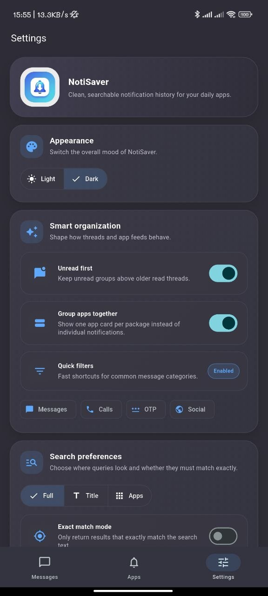
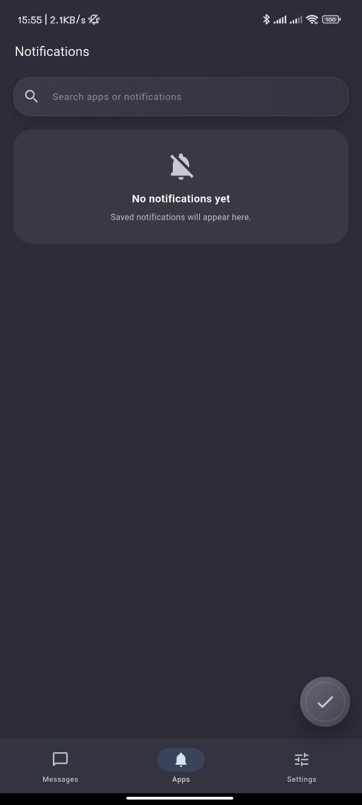

<div align="center">

# NotiSaver

### Android-only notification history with a cleaner inbox, richer settings, and chat-style viewing

[](https://flutter.dev/)
[](https://dart.dev/)
[](https://developer.android.com/)
[](https://www.sqlite.org/)
[](https://github.com/Azrul16/Notisaver-Flutter-app)

<br />

[](https://github.com/Azrul16/Notisaver-Flutter-app)
[](https://github.com/Azrul16/Notisaver-Flutter-app)
[](https://github.com/Azrul16/Notisaver-Flutter-app/fork)

</div>

<br />

<table align="center">
  <tr>
    <td width="58%">
      <h2>Why NotiSaver?</h2>
      <p>
        NotiSaver captures Android notifications locally, organizes them into cleaner message and app views,
        and makes old alerts easier to find later without depending on a remote backend.
      </p>
      <p>
        It is designed for people who want a more readable, searchable, and visually richer notification archive
        than the default system tray experience.
      </p>
      <ul>
        <li>Message-style browsing for chat-like notifications</li>
        <li>App-based archive for general alerts</li>
        <li>Modern settings UI with reliability tools and insights</li>
        <li>Local-first storage using SQLite</li>
      </ul>
    </td>
    <td width="42%" align="center">
      
    </td>
  </tr>
</table>

## Table of Contents

- [Getting Started In 60 Seconds](#getting-started-in-60-seconds)
- [Screenshots](#screenshots)
- [Feature Comparison](#feature-comparison)
- [Feature Cards](#feature-cards)
- [Core Features](#core-features)
- [How It Works](#how-it-works)
- [Storage and Privacy](#storage-and-privacy)
- [Android Requirements](#android-requirements)
- [Tech Stack](#tech-stack)
- [Project Structure](#project-structure)
- [Developer Commands](#developer-commands)
- [Android Build Commands](#android-build-commands)
- [Release / Download](#release--download)
- [Suggested Workflow](#suggested-workflow)
- [Contributing](#contributing)
- [Issues and Feedback](#issues-and-feedback)
- [Status](#status)
- [Support](#support)

## Getting Started In 60 Seconds

Clone the project:

```bash
git clone https://github.com/Azrul16/Notisaver-Flutter-app.git
cd Notisaver-Flutter-app
```

Install dependencies:

```bash
flutter pub get
```

Run the app:

```bash
flutter run
```

Run checks:

```bash
flutter analyze
flutter test
```

Build a debug APK:

```bash
flutter build apk --debug
```

## Screenshots

<div align="center">
  
  
  
  
</div>

## Feature Comparison

| Area | What You Get |
| --- | --- |
| `Messages` | Conversation-style grouping, unread/read switching, quick filters, search, favorites |
| `Apps` | App-grouped notification archive, optional grouping behavior, searchable history |
| `Settings` | Theme controls, search preferences, app filter, reliability tools, notification insights |
| `Storage` | Local-only persistence, duplicate reduction, normalized notification text, SQLite-backed archive |
| `UI / UX` | Animated surfaces, richer cards, modern settings panels, chat-style history screen |

## Feature Cards

<table>
  <tr>
    <td width="33%">
      <h3>Messages</h3>
      <p>Browse notifications like conversations with filters, search, favorites, and read-state awareness.</p>
    </td>
    <td width="33%">
      <h3>Apps</h3>
      <p>Review alerts by app, keep archives organized, and quickly jump through grouped notification history.</p>
    </td>
    <td width="33%">
      <h3>Settings</h3>
      <p>Control appearance, search, reliability tools, app exclusions, and notification insights in one place.</p>
    </td>
  </tr>
  <tr>
    <td width="33%">
      <h3>Local First</h3>
      <p>Notifications stay on-device using SQLite-backed storage rather than a hosted sync backend.</p>
    </td>
    <td width="33%">
      <h3>Android Native Bridge</h3>
      <p>Kotlin platform integration powers notification listening, reliability checks, and system settings access.</p>
    </td>
    <td width="33%">
      <h3>Modern UI</h3>
      <p>Animated cards, darker thread screens, richer controls, and a more attractive utility-app experience.</p>
    </td>
  </tr>
</table>

## Core Features

### Messages

- Conversation-style grouping
- Unread/read switching
- Quick filters for:
  - `Messages`
  - `Calls`
  - `OTP`
  - `Social`
- Search based on the selected search mode
- Favorite/save support and read-state tracking

### Apps

- App-grouped notification feed
- Optional grouped or more granular browsing behavior
- Searchable app and notification archive

### Settings

- Theme controls
- Search preferences
- Unread-first and grouping controls
- App exclusion management
- Notification insights
- Background reliability and listener-health tools

### UI / UX

- Modern card-based layout
- Animated transitions using `flutter_animate`
- Darker thread-style history screens
- More visual settings controls instead of plain text lists

## How It Works

1. The app requests notification access.
2. Android forwards notifications through a native notification-listener service.
3. Flutter receives notification payloads through platform channels.
4. Notifications are normalized, deduplicated, and stored locally.
5. The UI presents them in `Messages`, `Apps`, and `Settings`.

## Storage and Privacy

- Notifications are stored locally on the device
- Data is not uploaded to a backend by default
- SQLite is used for persistence
- Text is normalized and trimmed before storage
- Older notifications are purged using the app’s fixed retention policy

## Android Requirements

NotiSaver depends on:

- notification listener access
- battery optimization exemption support on stricter devices
- restart/update recovery support through boot/package-replaced handling

Some Android vendors may still require additional background or auto-start permissions.

## Tech Stack

- Flutter
- Dart
- Kotlin
- `sqflite`
- `shared_preferences`
- `flutter_animate`

## Project Structure

```text
lib/
  app.dart
  main.dart
  core/
    theme/
  data/
    database/
    models/
    repositories/
  features/
    notifications/
    permissions/
    settings/
    splash/
  services/

android/
  app/
```

## Developer Commands

Install dependencies:

```bash
flutter pub get
```

Run static analysis:

```bash
flutter analyze
```

Run tests:

```bash
flutter test
```

Clean generated files and restore packages:

```bash
flutter clean
flutter pub get
```

Check outdated packages:

```bash
flutter pub outdated
```

## Android Build Commands

Build debug APK:

```bash
flutter build apk --debug
```

Build release APK:

```bash
flutter build apk --release
```

Build Android App Bundle:

```bash
flutter build appbundle --release
```

Install on a connected device:

```bash
flutter install
```

## Release / Download

If you want to prepare distributable Android builds:

Debug APK:

```bash
flutter build apk --debug
```

Release APK:

```bash
flutter build apk --release
```

Release App Bundle:

```bash
flutter build appbundle --release
```

Recommended next step:

- Publish generated release artifacts through the GitHub Releases page for easier download and sharing.

## Suggested Workflow

```bash
git clone https://github.com/Azrul16/Notisaver-Flutter-app.git
cd Notisaver-Flutter-app
flutter pub get
flutter analyze
flutter test
flutter run
```

## Contributing

Contributions are welcome.

If you want to improve the UI, optimize notification processing, add device-specific fixes, or polish the Android experience:

1. Fork the repository
2. Create a feature branch
3. Make your changes
4. Run:

```bash
flutter analyze
flutter test
```

5. Open a pull request

## Issues and Feedback

Found a bug, device-specific reliability issue, or UI improvement idea?

- Open an issue on GitHub
- Include your device model and Android version when relevant
- Add screenshots/logs when reporting visual or notification-listener problems

Repository issues page:

- https://github.com/Azrul16/Notisaver-Flutter-app/issues

## Status

This project is currently in a strong MVP / polished prototype stage:

- local notification capture is working
- the core UI has been modernized and animated
- Android debug builds are passing
- baseline automated tests are in place

It is ready for more device testing, cleanup, and release preparation.

## Support

If you like this project or want to follow its progress:

- **Star** the repository
- **Fork** it and experiment with your own version
- Share feedback or ideas on GitHub

Repository: https://github.com/Azrul16/Notisaver-Flutter-app
